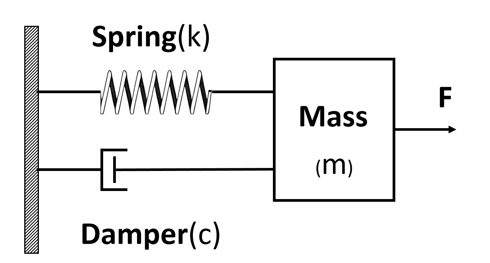
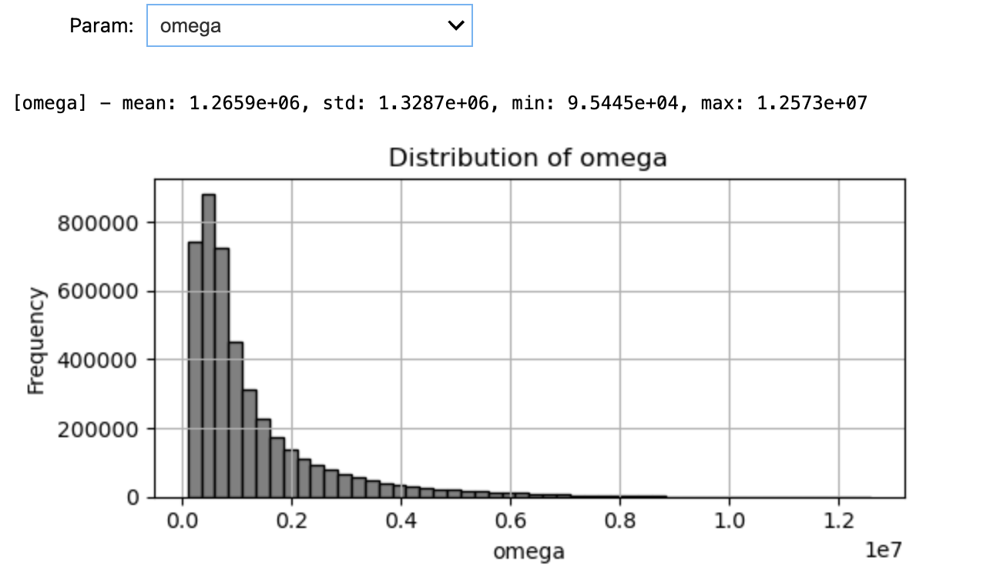
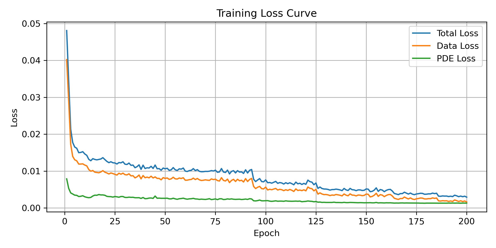
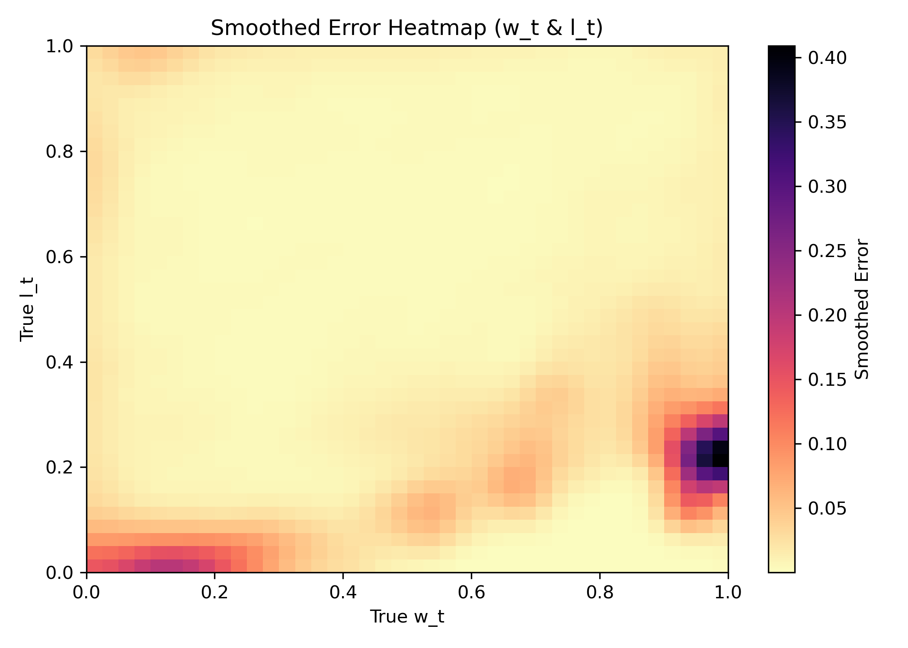
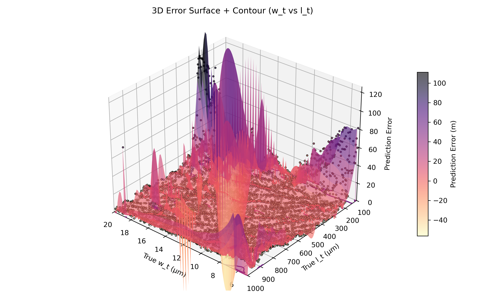
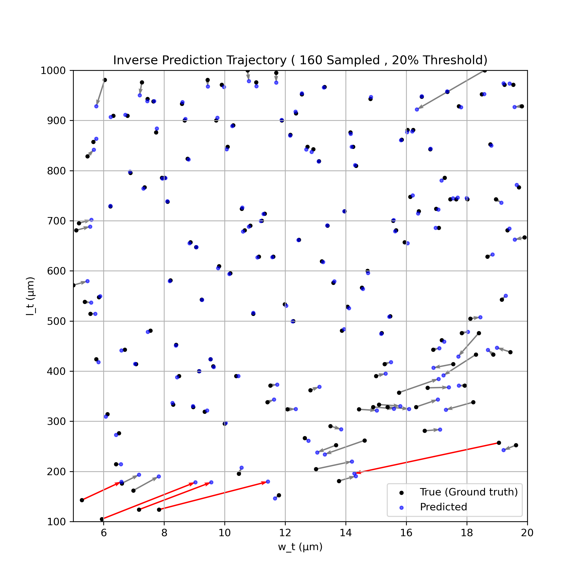
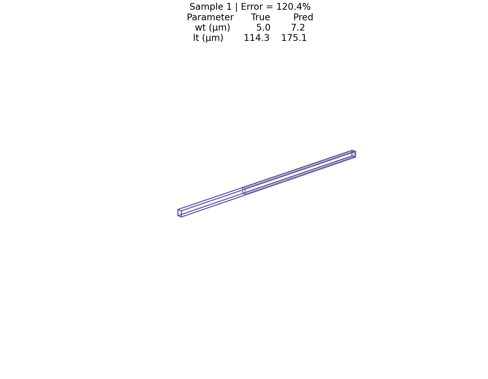

# PINN-based Parameter Inversion for Microbeam Resonators


##  1.PINN4MEMS - 项目背景

悬臂梁是最简单的谐振器结构类型之一，其两端分别为固定端和自由端，具有制作工艺简单、灵敏度高、易于集成等优点。悬臂梁通过表面吸附分子造成的质量变化引起自身频率发生改变，从而用于检测特定蛋白质、DNA 序列或化学物质的存在和浓度等，可广泛应用于生物医学以及生化检测领域。在工业生产和环境监测中，悬臂梁也常用于对湿度、温度、气体浓度等参数的实时感知。


### 1.1 弹簧-阻尼系统基础

悬臂梁谐振器的动态行为可初步建模为一个经典的弹簧-质量-阻尼系统。该系统是力学中用于研究物体振动响应与能量耗散行为的标准模型，构成包括一个质量块、一个线性弹簧和一个阻尼器，其结构示意如下：



系统的基本动力学控制方程为：

$$
m \frac{d^2x}{dt^2} + c \frac{dx}{dt} + kx = F(t)
$$

其中：

- $ m $：质量  
- $ c $：阻尼系数  
- $ k $：弹簧刚度系数  
- $ x $：系统位移  
- $ F(t) $：外部驱动力

然而，微尺度下的悬臂梁谐振器通常表现出比理想弹簧-质量系统更为复杂的行为。除了线性弹性与阻尼效应外，系统响应还受到如下因素的显著影响：

- 大变形几何非线性；
- 多阶本构关系导致的非线性刚度；
- 表面效应引发的质量与刚度扰动；
- 电场激励力与结构响应的耦合。

因此，为更真实地表征微梁结构的动力行为，需在传统 ODE 模型的基础上，引入非线性项与物理参数分布，进一步发展出结构物理一致的非线性偏微分方程（PDE）系统模型。


### 1.2 悬臂梁谐振器的非线性 PDE 物理建模

在实际应用中，悬臂梁结构受到交变电压驱动后，其振动行为需由非线性动力学方程进行建模。基于能量守恒与非线性项展开考虑，在谐波稳态激励下，其一阶模态主响应满足如下非线性代数方程组：

$$
-M\omega^2 y + (k_t - k_e)y + (k_{t3} - k_{e3})\frac{3}{4}y^3 - F_{\text{ac}} \cos(\phi) = 0
$$

$$
c\omega y - F_{\text{ac}} \sin(\phi) = 0
$$

其中各物理项定义如下：

- $ M $：等效质量项
- $ k_t, k_{t3} $：结构固有线性刚度与三阶非线性刚度
- $ k_e, k_{e3} $：电致刚度项（与电场激励耦合）
- $ y $：一阶谐波响应幅值（主模态）
- $ \omega $：激励角频率
- $ \phi $：相位差
- $ F_{\text{ac}} = \text{Vac} \cdot \text{trans\_factor} $：激励力振幅（由电场激励转换因子计算）
- $ c = \dfrac{\sqrt{M k_t}}{Q} $：等效阻尼系数

上述两个方程分别代表系统主响应在共振频率附近的**共振平衡条件**（实部）与**阻尼平衡条件**（虚部）。

为确保解的物理可行性，在频率域中对解空间进行限制筛选，频率必须满足：

$$
\frac{\omega_0}{2} < \omega < \frac{3\omega_0}{2}, \quad \omega > 0
$$

其中 $ \omega_0 = \sqrt{k_t / M} $ 为系统的线性本征频率。

该非线性模型为 PINN 中构建物理残差项提供基础，用于指导网络反演的物理合理性与动态一致性。

### 1.3 物理常数与参数设置

在实际进行悬臂梁谐振器的非线性动力学建模与参数反演过程中，合理的物理参数设定对于模型的准确性和后续 PINN 方法的收敛性至关重要。

本项目涉及的主要参数分为以下三类：

#### 1.3.1 物理常数（固定不变）

| 名称         | 变量名   | 数值       | 单位   | 含义         |
|--------------|----------|------------|--------|--------------|
| 杨氏模量     | `E`      | 169e9      | Pa     | 弹性模量     |
| 材料密度     | `rho`    | 2330       | kg/m³  | 硅密度       |
| 梁厚度       | `t`      | 25e-6      | m      | 梁截面厚度   |
| 真空介电常数 | `eps_0`  | 8.85e-12   | F/m    | 电场常数     |
| 第一模态参数 | `beta`   | 4.73       | -      | 固定根值     |

#### 1.3.2 结构/电气参数（可扩展为变量）

| 名称                   | 变量名            | 当前数值 | 单位   | 采样点数 | 说明                 | 采样范围           |
|------------------------|-------------------|-----------|--------|-----------|----------------------|---------------------|
| 驱动电压               | `V`               | 5         | V      | 10        | DC 激励电压          | [1, 10]             |
| 电极间隙               | `d`               | 6e-6      | m      | 9         | 顶/底电极间距        | [2e-6, 10e-6]       |
| 电极长度               | `electrode_length`| 700e-6    | m      | 81        | 电极长度             | [100e-6, 900e-6]    |
| 电极宽度               | `electrode_width` | 20e-6     | m      | 26        | 电极宽度             | [5e-6, 30e-6]       |
| 端部质量块宽度         | `w_c`             | 10e-6     | m      | 76        | 末端质量块宽度       | [5e-6, 20e-6]       |
| 端部质量块长度         | `l_c`             | 20e-6     | m      | 26        | 末端质量块长度       | [5e-6, 30e-6]       |
| 驱动 Vac               | `Vac_ground`      | 5e-3      | V      | 1         | 小信号驱动电压       | 可微调              |
| 品质因子               | `Q`               | 10000     | -      | 19        | 机械品质因子         | [5000, 47500]       |

#### 1.3.3 扫描参数

| 名称   | 变量名 | 范围             | 单位 | 采样点数 | 说明         |
|--------|--------|------------------|------|-----------|--------------|
| 梁宽   | `w_t`  | [5e-6, 20e-6]     | m    | 16        | 梁的横向宽度 |
| 梁长   | `l_t`  | [100e-6, 1000e-6] | m    | 19        | 梁的长度     |

### 1.4 重要中间参数及其物理意义

在参数建模与 PDE 推导过程中，还需要引入一系列物理中间量，用于描述电-机械耦合、结构刚度、积分系数等，以下列出主要公式与其物理含义：

#### 电-机械耦合因子

- **交流电压幅值（Vac）**：谐波驱动信号的强度。
- **转移因子（trans_factor）**：

$$
\text{trans\_factor} = \frac{\varepsilon_0 \cdot V \cdot \text{electrode\_length} \cdot t}{d^2}
$$

- **等效电刚度**：

$$
k_e = 2 \cdot \text{trans\_factor} \cdot \frac{V}{d}
$$

$$
k_{e3} = 4 \cdot \text{trans\_factor} \cdot \frac{V}{d^3}
$$

#### 结构刚度积分系数

- **线性刚度积分项**：

$$
k_{\text{coef\_b}} = \int \frac{(\text{second\_derivative})^2}{l_t} \, dx
$$

- **非线性刚度积分项**：

$$
k_{\text{coef\_b3}} = \int \frac{(\text{first\_derivative})^2}{l_t} \, dx
$$

#### 归一化结构刚度表达式

- **一阶结构刚度（线性项）**：

$$
k_{tt} = \frac{k_{\text{coef\_b}}}{12} \cdot E \cdot t \left( \frac{w_t}{l_t} \right)^3
$$

- **三阶结构刚度（非线性项）**：

$$
k_{t3} = k_{\text{coef\_b3}} \cdot E \cdot t \cdot \frac{w_t}{l_t^3}
$$


## 2. 数据加载与预处理

本节主要完成 MEMS 悬臂梁结构频响数据的加载与预处理，并基于理论模型计算对应的中间物理参数（质量、等效刚度项、非线性项、阻尼系数等），为后续 PINN 网络训练准备输入与监督信号。


### 2.1 加载 HDF5 数据与物理常数

我们从 `wt_lt_big.h5` 文件中读取预处理后的有效样本（已去除 NaN）以及与实验相关的固定常数参数：

```python
with pd.HDFStore('./data/wt_lt_big.h5', 'r') as store:
    df = store['data_valid']
    constants = store.get_storer('data').attrs.constants
    phi_full = np.array(constants['phi'])
```
### 2.2 计算转导引子

随后，计算全局的**转导因子**（electromechanical transduction factor）：

$$
\text{trans\_factor} = \frac{\varepsilon_0 V L_e t}{d^2}
$$

并进一步定义：

```python
FAC_FIXED = constants['Vac_ground'] * trans_factor_global
```

该项将在后续用于机械驱动力计算中。附加常数项（$m\_{\text{coef}}, k\_{\text{coef}}, k\_{\text{coef}}^3$）也被提取并保存在 `constants` 中。

---

### 2.3 频率响应数据预处理

根据下列理论公式，结合实际观测的 `freq` 与 `m_c`，计算等效频率角速度 `ω` 和位移响应 `y`：

$$
\omega = 2\pi f 
$$
$$
y = \frac{m_c \times 10^{-9}}{\omega \cdot \text{trans\_factor}}
$$

代码如下：

```python
def preprocess_sample(row, trans_factor):
    freq = np.array(row['freq'])
    m_c = np.array(row['m_c'])
    omega = 2 * np.pi * freq
    y = m_c * 1e-9 / (omega * trans_factor)
    return freq, m_c, omega, y
```

此外，还计算了目标参数 `w_t`, `l_t` 及物理量 `M`, `Δk_t`, `Δk_{t3}`, `c`：

* $\Delta k_t = k_{tt} - k_e$
* $\Delta k_{t3} = k_{t3} - k_{e3}$
* $c = \sqrt{M \cdot k_{tt}} / Q$

---

### 2.4 参数归一化处理（MinMax）

由于不同物理量量纲差异较大，为保证网络训练稳定性，采用 `MinMaxScaler` 对目标参数与中间物理量进行归一化：

```python
scalers['wt']   = MinMaxScaler().fit(wt_arr)
scalers['lt']   = MinMaxScaler().fit(lt_arr)
scalers['M']    = MinMaxScaler().fit(M_arr)
scalers['dkt']  = MinMaxScaler().fit(dkt_arr)
scalers['dk3t'] = MinMaxScaler().fit(dk3t_arr)
scalers['c']    = MinMaxScaler().fit(c_arr)
```

处理后的结果如下：

```python
wt_norm   = scalers['wt'].transform(wt_arr).flatten()
lt_norm   = scalers['lt'].transform(lt_arr).flatten()
M_norm    = scalers['M'].transform(M_arr).flatten()
dkt_norm  = scalers['dkt'].transform(dkt_arr).flatten()
dk3t_norm = scalers['dk3t'].transform(dk3t_arr).flatten()
c_norm    = scalers['c'].transform(c_arr).flatten()
```

**注意**：驱动项 `Fac` 为常数，统一归一化为 1。

---

### 2.5 保存归一化器

为便于后续反归一化和预测计算，所有归一化器对象通过 `pickle` 序列化保存：

```python
with open('./norm_scalers.pkl', 'wb') as f:
    pickle.dump(scalers, f)
```

---

### 2.6 归一化样本预览（示例）

以前两组样本为例，展示归一化后的目标值与中间参数：

```python
Normalized Sample 0:
  wt_norm: 0.25, lt_norm: 0.5
  M_norm: 0.32, Δkt_norm: 0.78, Δkt3_norm: 0.35, Fac_norm: 1.0, c_norm: 0.92
```

### 2.7 数据分布可视化与归一化评估

本节旨在检查各物理量的数值分布情况，包括网络输入输出与中间参数。此步骤有助于确认归一化尺度的合理性，避免模型训练阶段出现梯度爆炸或收敛困难。

我们将原始的 `omega`、`y`、`w_t`、`l_t`、`M`、`Δkt`、`Δkt3`、`c` 等物理参数进行拼接、统计与可视化。

#### 可视化代码实现：

```python
# ====================
# 7. 归一化统计与可视化交互
# ====================
param_dict = {
    'omega': np.concatenate(omega_list),
    'y': np.concatenate(y_list),
    'wt': wt_arr.flatten(),
    'lt': lt_arr.flatten(),
    'M': M_arr.flatten(),
    'dkt': dkt_arr.flatten(),
    'dk3t': dk3t_arr.flatten(),
    'Fac': Fac_arr.flatten(),
    'c': c_arr.flatten()
}

def plot_distribution(param):
    data = param_dict[param]
    print(f"\n[{param}] - mean: {np.mean(data):.4e}, std: {np.std(data):.4e}, min: {np.min(data):.4e}, max: {np.max(data):.4e}")
    plt.figure(figsize=(6, 3))
    plt.hist(data, bins=50, color='gray', edgecolor='black')
    plt.title(f"Distribution of {param}")
    plt.xlabel(param)
    plt.ylabel("Frequency")
    plt.grid(True)
    plt.tight_layout()
    plt.show()

param_selector = widgets.Dropdown(
    options=list(param_dict.keys()),
    description='Param:',
    value='omega'
)
widgets.interact(plot_distribution, param=param_selector)
```

#### 控制台输出示例：

```bash
[omega] - mean: 3.1451e+08, std: 2.2303e+07, min: 2.9330e+08, max: 4.3212e+08
```

#### 可视化示例（以 `omega` 为例）：





> 分布图显示 `omega` 数据集中主要集中于 $9.54 \times 10^4$ 到 $1.25 \times 10^7$ 范围，均值约为 $1.27 \times 10^6$。分布较为集中，归一化处理应保持信息完整性。

你可以切换其他变量（如 `c`, `dk3t` 等）进行可视化分析，确保所有变量均在合理数值范围之内。


###  2.8 特征统计提取与归一化处理

为了将变长的频率响应序列映射为固定维度的神经网络输入，我们提取每组样本的统计特征，包括频率 $\omega$ 和位移响应 $y$ 的最小值、最大值、均值、标准差等共 8 个指标：

- $\omega_\text{min}$, $\omega_\text{max}$, $\omega_\text{mean}$, $\omega_\text{std}$
- $y_\text{min}$, $y_\text{max}$, $y_\text{mean}$, $y_\text{std}$

同时，为了提升数值稳定性，$y$ 在统计前被放大 $10^8$ 倍。

**提取函数调用如下：**

```python
X_feat_raw, per_sample_scalers, omega_norm_all, y_norm_all = extract_statistical_features_per_sample(omega_list, y_list)
```

我们对提取的特征进行标准归一化，并保存相关归一化器与中间变量：

```python
scalers['X_feat'] = StandardScaler().fit(X_feat_raw)
scalers['per_sample_scalers'] = per_sample_scalers

X_feat = scalers['X_feat'].transform(X_feat_raw)
Y_target = np.stack([wt_norm, lt_norm], axis=1)
Y_phys = np.stack([M_norm, dkt_norm, dk3t_norm, c_norm], axis=1)
```

**示例输出：**

```bash
Sample 0:
  omega_min   : 3.1513e+01
  omega_max   : 4.3167e+01
  omega_std   : 1.2345e+00
  omega_mean  : 3.4567e+01
  y_min       : 1.2345e+00
  y_max       : 3.4567e+00
  y_std       : 5.6789e-01
  y_mean      : 2.3456e+00
```

最终，所有归一化器被保存至磁盘以供后续训练调用：

```python
with open('./norm_scalers.pkl', 'wb') as f:
    pickle.dump(scalers, f)
```

###  2.9 归一化后特征的统计分布分析

为评估归一化后输入特征的分布情况，我们提供交互式直方图绘图函数。可视化对象包括：

- 输入特征：`omega_mean`, `omega_std`, ..., `y_min`
- 输出目标：`wt_norm`, `lt_norm`
- 物理参数：`M_norm`, `dkt_norm`, `dk3t_norm`, `c_norm`

交互控件如下：

```python
widgets.interact(plot_normalized_distribution, param=param_selector_norm)
```

**示例输出（`omega_mean`）统计量：**

```bash
[omega_mean] - mean: 0.5012, std: 0.1764, min: 0.0000, max: 1.0000
```

**示意图：**


###  2.10 预测结果反归一化与物理参数计算


在 PINN 网络预测完成后，网络输出的是经过归一化（Min-Max Scaling）处理后的梁宽 $w_t^\text{norm}$ 和梁长 $l_t^\text{norm}$。为了将其用于物理残差项的计算，我们首先需将其**反归一化**恢复为实际尺寸：

$$
w_t = \text{Min}_w + (w_t^\text{norm}) \cdot (\text{Max}_w - \text{Min}_w)
$$

$$
l_t = \text{Min}_l + (l_t^\text{norm}) \cdot (\text{Max}_l - \text{Min}_l)
$$

得到真实尺寸后，我们根据微悬梁的结构力学模型推导其物理参数：

#### 1. 有效质量 $M$

梁的等效质量 $M$ 表达为：

$$
M = \rho \left( t \cdot w_t \cdot l_t \cdot m_\text{coef} + l_\text{elec} \cdot w_\text{elec} \cdot t + 2 w_c l_c t \right)
$$

其中，$m_\text{coef}$ 是形状因子，$t$ 为梁厚度，$w_c, l_c$ 为连接电极尺寸。


#### 2. 有效刚度项 $\Delta k_t$

线性刚度项包含本构刚度 $k_t$ 与电容引起的软化项 $k_e$：

$$
k_t = \frac{k_\text{coef}}{12} \cdot E \cdot t \cdot \left( \frac{w_t}{l_t^3} \right)
$$

$$
k_e = \frac{2 \varepsilon_0 V^2 l_\text{elec} t}{d^3}
$$

最终有效线性刚度为：

$$
\Delta k_t = k_t - k_e
$$


#### 3. 非线性刚度项 $\Delta k_{t3}$

类似地，立方刚度项包括：

$$
k_{t3} = k_{\text{coef3}} \cdot E \cdot t \cdot \frac{w_t}{l_t^3}, \quad
k_{e3} = \frac{4 \varepsilon_0 V^2 l_\text{elec} t}{d^5}
$$

则：

$$
\Delta k_{t3} = k_{t3} - k_{e3}
$$

#### 4. 阻尼项 $c$

根据阻尼模型（如结构阻尼或Rayleigh近似），阻尼常数表示为：

$$
c = \frac{1}{Q} \cdot \sqrt{M \cdot k_t}
$$


#### 5. 归一化输出（用于损失函数）

为了将上述物理参数用于 PINN 的残差损失计算，我们还需将这些物理量再做一次 Min-Max 标准化处理，与训练时的物理监督量保持一致：

$$
X^\text{norm} = \frac{X - \min(X)}{\max(X) - \min(X)}
$$

最终，返回的字典包括：

- 原始预测尺寸：`wt`, `lt`
- 推导物理参数：`M`, `Δk_t`, `Δk_{t3}`, `c`
- 对应归一化值：`M_norm`, `dkt_norm`, `dk3t_norm`, `c_norm`

---

这些结果将用于下一步残差项构建（物理一致性约束）的损失函数中。


函数返回反归一化结果与物理推导值（含归一化版本），如下：

```python
{
  'wt': [0.00013],
  'lt': [0.00108],
  'M': [...], 'dkt': [...], 'dk3t': [...], 'c': [...],
  'M_norm': [...], ...
}
```


## 3. 网络结构设计：PINNInverseMLP

本项目采用一个前馈全连接神经网络（MLP）结构，用于实现频谱统计特征到结构尺寸（梁宽 $w_t$ 与梁长 $l_t$）之间的反演映射。

---

#### 输入与输出

- **输入维度**：8  
  对应提取自归一化后 $\omega$ 和 $y$ 序列的统计特征（最小值、最大值、均值、标准差）：
  - $\omega_\text{min}$, $\omega_\text{max}$, $\omega_\text{mean}$, $\omega_\text{std}$
  - $y_\text{min}$, $y_\text{max}$, $y_\text{mean}$, $y_\text{std}$

- **输出维度**：2  
  预测两个归一化参数：
  - $w_t^\text{norm}$：梁宽的归一化值
  - $l_t^\text{norm}$：梁长的归一化值

---

#### 网络结构说明

- 激活函数：全层使用 **Tanh**
- 隐藏层数：默认 4 层，隐藏单元数为 128（可配置）
- 输出层使用 **Sigmoid** 函数，以确保输出范围在 $[0, 1]$，对应归一化的结构尺寸区间

---

#### 网络结构表达式

若输入为 $\mathbf{x} \in \mathbb{R}^8$，网络可形式化表示为：

$$
\hat{\mathbf{y}} = \sigma\left( W_L \cdot \tanh \left( W_{L-1} \cdot \tanh \left( \cdots \tanh(W_1 \cdot \mathbf{x} + b_1) \right) + b_{L-1} \right) + b_L \right)
$$

其中 $\sigma(\cdot)$ 表示 Sigmoid 函数，$L$ 为总层数。

---

#### 模块实现（PyTorch）

模型定义封装为类 `PINNInverseMLP`，便于后续训练与调用。结构灵活支持：

- 更改隐藏层数与宽度
- 启用/禁用 Dropout
- 添加 BatchNorm（如后续扩展）

该网络作为 Data-driven 与 Physics-informed 损失的核心预测器。


## 4. 数据集构建与加载器设计

### 4.1 自定义 Dataset：`PINNDataset`

本项目采用 PyTorch 中的 `Dataset` 接口封装数据，用于支持神经网络模型的批量训练与物理残差计算。每一个样本包含：

* `X`: 输入特征，形状为 $[8]$，为 $\omega$ 与 $y$ 序列的统计量
* `Y_target`: 预测目标 $[w\_t^\text{norm}, l\_t^\text{norm}]$
* `Y_phys`: PDE 所需的真实归一化物理参数 $[\tilde{M}, \Delta\tilde{k}, \Delta\tilde{k}\_3, \tilde{c}]$
* `omega`: 归一化角频率序列 $\omega\_i \in \mathbb{R}^{T\_i}$
* `y`: 归一化振动位移序列 $y\_i \in \mathbb{R}^{T\_i}$
* `phi`: 驱动相位角序列 $\phi\_i \in \mathbb{R}^{T\_i}$

**注意**：由于序列为变长（$T\_i$ 不等），这些字段不会被张量堆叠，需使用自定义 `collate_fn`。

#### 自定义 `collate_fn`：`variable_length_collate`

为适配变长度数据，设计自定义批处理函数：

* 对固定长度字段（如 `X`、`Y_target`、`Y_phys`）使用 `torch.stack`
* 对变长字段保留为 `list`，供后续残差项逐样本独立计算

---

### 4.2 构建 DataLoader：`build_dataloaders`

采用 `train_test_split` 划分训练集与测试集（比例 8:2），并构建：

* `train_loader`：用于训练阶段，`shuffle=True`
* `test_loader`：用于评估阶段，`shuffle=False`

输出数据结构统一为 batch 字典：
```python
batch = {
    "X": Tensor[B, 8],             # 输入特征
    "Y_target": Tensor[B, 2],      # 预测目标 (wt_norm, lt_norm)
    "Y_phys": Tensor[B, 4],        # PDE 所需真实物理参数
    "omega": List[Tensor[T_i]],    # 每样本变长角频率序列
    "y": List[Tensor[T_i]],        # 每样本变长位移序列
    "phi": List[Tensor[T_i]]       # 每样本变长相位角序列
}
```

其中：

* `X`、`Y_target`、`Y_phys` 为 shape 为 `[B, \cdot]` 的张量
* `omega`, `y`, `phi` 为长度为 `B` 的 Python 列表，每项为变长序列

此结构为后续损失函数中按样本处理 PDE 残差打下基础。


## 5. 定义损失函数（Loss）

PINN 的训练目标不仅要求预测结果与监督数据一致，还需要满足一定的物理约束。因此，我们设计了三类损失函数：

* 数据拟合损失（Data Loss）
* PDE 残差损失（Physics-Informed PDE Loss）
* 组合损失函数（Total Loss）

---

### 5.1 数据项损失函数（Data Loss）

数据损失通过均方误差（MSE）度量预测输出 $(\hat{w}\_t, \hat{l}\_t)$ 与真实标签之间的差距：

$$
\mathcal{L}_\text{data} = \frac{1}{B} \sum_{i=1}^B \left\| \hat{y}^{(i)} - y^{(i)} \right\|_2^2
$$

代码如下：

```python
def data_loss(pred_wtlt_norm, true_wtlt_norm):
    """
    数据项损失函数（监督回归损失）
    """
    return nn.MSELoss()(pred_wtlt_norm, true_wtlt_norm)
```

以下是你要求的 **4.2 PDE 物理残差损失（Physics-Informed Loss）** 的修订版，补充了完整的力学表达含义与数学公式，强调了每一项物理项的意义，遵循学术风格：

---

### 5.2 PDE 物理残差损失（Physics-Informed Loss）

在微悬臂梁系统中，其动力学行为可以近似由如下非线性强迫振动微分方程描述：

$$
M \ddot{y} + c \dot{y} + \Delta k_t y + \Delta k_{t3} y^3 = F(t)
$$

通过频域变换，令激励为正弦信号 $F(t) = \text{Fac} \cdot \cos(\omega t + \phi)$，可得到频域下的两个稳态平衡分量：

$$
\begin{aligned}
F_1 &= -M \omega^2 y + \Delta k_t y + \tfrac{3}{4} \Delta k_{t3} y^3 - \text{Fac} \cos(\phi) \\
F_2 &= c \omega y - \text{Fac} \sin(\phi)
\end{aligned}
$$

其中：

* $M$ 是质量项；
* $\Delta k\_t$ 是修正后的一阶弹性系数；
* $\Delta k\_{t3}$ 是三次非线性刚度；
* $c$ 是等效阻尼；
* $y$ 是系统响应；
* $\omega$ 是角频率；
* $\phi$ 是驱动相位；
* $\text{Fac}$ 是激励幅值项。

我们构造两组预测-真实力学表达的残差项：

$$
\begin{aligned}
R_1 &= F_1^{\text{true}} - F_1^{\text{pred}} \\
R_2 &= F_2^{\text{true}} - F_2^{\text{pred}}
\end{aligned}
$$

最终物理残差损失函数为两组平均平方误差的加权平均：

$$
\mathcal{L}_\text{phys} = \frac{1}{2} \left( \mathbb{E}[R_1^2] + \mathbb{E}[R_2^2] \right)
$$

对应实现如下：

```python
def pde_loss(pred_wtlt_norm, true_wtlt_norm, true_phys,
             inverse_func, scalers, constants,
             omega_batch, y_batch, phi, device='cpu'):
    """
    PDE残差损失：基于预测的结构尺寸，计算物理参数后代入微分方程构造残差项
    """
    B = pred_wtlt_norm.shape[0]

    # 反归一化预测结构尺寸，并计算物理参数
    with torch.no_grad():
        pred_wt = pred_wtlt_norm[:, 0].cpu().numpy()
        pred_lt = pred_wtlt_norm[:, 1].cpu().numpy()
        pred_phys_dict = inverse_func(pred_wt, pred_lt, scalers, constants)

    # 解构真实值
    true_M    = true_phys[:, 0]
    true_dkt  = true_phys[:, 1]
    true_dk3t = true_phys[:, 2]
    true_c    = true_phys[:, 3]

    # 转为 tensor（预测值）
    pred_M    = torch.tensor(pred_phys_dict['M_norm'],    dtype=torch.float32, device=device)
    pred_dkt  = torch.tensor(pred_phys_dict['dkt_norm'],  dtype=torch.float32, device=device)
    pred_dk3t = torch.tensor(pred_phys_dict['dk3t_norm'], dtype=torch.float32, device=device)
    pred_c    = torch.tensor(pred_phys_dict['c_norm'],    dtype=torch.float32, device=device)

    loss_R1_list = []
    loss_R2_list = []

    for i in range(B):
        omega_i = torch.tensor(omega_batch[i], dtype=torch.float32, device=device)
        y_i     = torch.tensor(y_batch[i],     dtype=torch.float32, device=device)
        phi_i   = torch.tensor(phi[i],         dtype=torch.float32, device=device)

        # 构造 F1 和 F2 分量
        w2y_true = -true_M[i] * omega_i**2 * y_i
        w2y_pred = -pred_M[i] * omega_i**2 * y_i

        lin_y_true = true_dkt[i] * y_i
        lin_y_pred = pred_dkt[i] * y_i

        nonlin_y_true = true_dk3t[i] * (y_i**3) * 3.0 / 4.0
        nonlin_y_pred = pred_dk3t[i] * (y_i**3) * 3.0 / 4.0

        drive_cos = torch.cos(phi_i)
        drive_sin = torch.sin(phi_i)

        F1_true = w2y_true + lin_y_true + nonlin_y_true - drive_cos
        F1_pred = w2y_pred + lin_y_pred + nonlin_y_pred - drive_cos

        F2_true = true_c[i] * omega_i * y_i - drive_sin
        F2_pred = pred_c[i] * omega_i * y_i - drive_sin

        # 残差项
        R1 = F1_true - F1_pred
        R2 = F2_true - F2_pred

        loss_R1_list.append(torch.mean(R1**2))
        loss_R2_list.append(torch.mean(R2**2))

    return 0.5 * (torch.stack(loss_R1_list).mean() + torch.stack(loss_R2_list).mean())
```

该残差计算策略通过频域模型等效控制系统中的非线性物理一致性，使模型学习不仅仅依赖于监督样本，更蕴含结构设计的真实约束条件。由此显著提升模型的泛化与可解释性。


### 5.3 总损失函数（Combined PINN Loss）

总损失函数由数据项与物理残差加权组合而成：

$$
\mathcal{L}_\text{total} = \mathcal{L}_\text{data} + \lambda_\text{phys} \cdot \mathcal{L}_\text{phys}
$$

$\lambda\_\text{phys}$ 是权重超参数，用于控制物理项约束的强度。

```python
def pinn_loss(pred_wtlt_norm, true_wtlt_norm, true_phys_norm,
              inverse_func, scalers, constants,
              omega_batch, y_batch, phi, device, lambda_phys=5.0):
    loss_data = data_loss(pred_wtlt_norm, true_wtlt_norm)
    loss_phys = lambda_phys * pde_loss(
        pred_wtlt_norm, true_wtlt_norm, true_phys_norm,
        inverse_func, scalers, constants,
        omega_batch, y_batch, phi, device
    )
    loss_total = loss_data + loss_phys
    return loss_total, loss_data.item(), loss_phys.item()
```

> ✅ 返回值为：`(loss_total, loss_data, loss_phys)`，可用于独立监控训练过程中的多项损失。


## 6. 模型训练与优化过程

### 6.1 训练循环设计（Train Loop）

训练采用标准的 PyTorch 迭代方式，结合 **PDE 物理一致性约束** 与 **数据监督项**，并整合如下关键机制以提升稳定性与收敛效率：

* **`tqdm` 训练进度条**：动态显示训练过程；
* **学习率调度器**：使用 `ReduceLROnPlateau` 策略对 `Adam` 优化器学习率进行自适应缩减；
* **Loss 分离记录**：将总损失（`total`）、数据项（`data`）与 PDE 残差项（`pde`）分别记录；
* **可选 Early Stopping**：避免过拟合（默认注释）。

```python
def train(model, dataloader, optimizer, inverse_func, scalers, constants,
          device='cpu', num_epochs=100,
          scheduler_patience=10, earlystop_patience=20):
    ...
```

在每一轮训练中，我们迭代 DataLoader 获取：

* `X`: 每个样本的统计特征（形状固定）；
* `Y_target`: 尺寸标签（$\hat{w}\_t$, $\hat{l}\_t$）；
* `Y_phys`: 真实物理参数标签；
* `omega`, `y`, `phi`: 每个样本对应的非结构化频域响应序列。

模型输出预测尺寸后，依次计算：

$$
\begin{aligned}
\mathcal{L}_\text{data} &= \mathbb{E}\left[ \|\hat{w}_t - w_t\|^2 + \|\hat{l}_t - l_t\|^2 \right] \\
\mathcal{L}_\text{pde}  &= \frac{1}{2} \left( \mathbb{E}[R_1^2] + \mathbb{E}[R_2^2] \right)
\end{aligned}
$$

总损失为：

$$
\mathcal{L}_\text{total} = \mathcal{L}_\text{data} + \lambda_\text{phys} \cdot \mathcal{L}_\text{pde}
$$

其中 $\lambda\_\text{phys}$ 为权重因子（默认为 5.0）。

---

### 6.2 训练执行函数（Run Training）

训练主函数统一封装网络初始化、优化器设定、数据加载器构建及训练过程触发，最终返回训练完成的模型与损失记录：

```python
def run_training(X_feat, Y_target, Y_phys, phi, omega_norm_all, y_norm_all,
                 inverse_func, scalers, constants,
                 hidden_dim=128, hidden_layers=4, num_epochs=100, batch_size=32, lr=1e-3, device='cpu'):
    ...
```

该函数返回：

* `model`：训练后的网络；
* `train_loader` / `test_loader`：训练与测试样本划分；
* `loss_history`：完整损失历史记录（便于绘图与后续分析）。

## 7.主函数与训练流程调用

### 7.1 数据结构准备

在启动训练之前，我们首先对输入输出数据格式进行标准化整理，以确保数据在传递给训练函数 `run_training` 时能够正确索引与批处理：

```python
# 保证输入为 NumPy array，避免索引错误
X_feat = np.array(X_feat)

# 输出目标为尺寸（梁宽 w_t，梁长 l_t），拼接成二维张量
Y_target = np.stack([wt_norm, lt_norm], axis=1)

# PDE 物理监督量：质量 M、有效刚度 Δkt、三阶刚度 Δkt3、阻尼系数 c
Y_phys = np.stack([M_norm, dkt_norm, dk3t_norm, c_norm], axis=1)
```

此外，非结构化频域响应序列 $\omega$、$y$ 以及激励相位 $\phi$ 需保持原始变长形式（`list of array`）：

```python
phi = list(df['phi'].values)
omega_norm_all = list(omega_norm_all)
y_norm_all = list(y_norm_all)
```


### 7.2 启动训练流程

调用 `run_training` 函数，配置模型结构参数、训练轮数、设备设定等，并启动主训练流程。

```python
model, train_loader, test_loader, loss_history = run_training(
    X_feat=X_feat,
    Y_target=Y_target,
    Y_phys=Y_phys,
    phi=phi,
    omega_norm_all=omega_norm_all,
    y_norm_all=y_norm_all,
    inverse_func=inverse_transform_param,
    scalers=scalers,
    constants=constants,
    hidden_dim=128,
    hidden_layers=4,
    num_epochs=200,
    batch_size=32,
    lr=1e-3,
    device='cuda' if torch.cuda.is_available() else 'cpu'
)
```

## 8.可视化与误差分析

### 8.1 训练误差收敛曲线（Loss Curve）

为了全面评估网络在训练过程中对监督目标（Data）与物理残差项（PDE）的拟合效果，我们绘制了如下训练损失曲线图，包括：

* **Total Loss**：总损失，定义为数据项损失与物理项残差加权和；
* **Data Loss**：尺寸预测误差；
* **PDE Loss**：基于物理微分方程残差的误差。

#### 样例绘图代码

```python
def plot_loss_curve(loss_history, save_path=None):
    epochs = np.arange(1, len(loss_history['total']) + 1)
    plt.figure(figsize=(8, 4))
    plt.plot(epochs, loss_history['total'], label='Total Loss')
    plt.plot(epochs, loss_history['data'], label='Data Loss')
    plt.plot(epochs, loss_history['pde'], label='PDE Loss')
    plt.xlabel("Epoch")
    plt.ylabel("Loss")
    plt.title("Training Loss Curve")
    plt.legend()
    plt.grid(True)
    plt.tight_layout()
    if save_path:
        plt.savefig(save_path, dpi=300)
        print(f"✅ Loss curve saved to {save_path}")
    plt.show()
```

调用方式：

```python
plot_loss_curve(loss_history, save_path='./viz/loss_curve.png')
```

#### 输出示意

```bash
✅ Loss curve saved to ./viz/loss_curve.png
```





> 从曲线可观察到：在前若干轮迭代中，PDE Loss 会显著下降；随着数据项稳定拟合，总体 Loss 会进入收敛区间，通常在 $\mathcal{O}(10^{-3})$ 或更低的量级。


### 8.2 基于尺寸参数的反演误差热图

在本节中，我们通过二维直方图统计 $(w\_t, , l\_t)$ 平面上不同真实结构尺寸下模型的预测误差，并使用高斯模糊（Gaussian Filter）进行平滑处理，生成误差分布的热图。

该图能够展示不同尺寸组合区域的预测偏差强弱，从而直观评估模型在不同结构尺度下的稳定性和泛化能力。

#### 示例绘图函数

```python
def plot_error_heatmap(model, dataloader, scalers, device='cpu', inverse=False, bins=40, sigma=1.0, save_path=None):
    ...
```

调用方式如下：

```python
plot_error_heatmap(
    model, test_loader, scalers,
    device='cpu',
    bins=40,
    sigma=1.2,
    save_path='./viz/error_heatmap.png'
)
```

#### 可视化逻辑说明：

1. **误差计算方式**：
   设 $\hat{w}\_t, \hat{l}\_t$ 为预测值，$w\_t, l\_t$ 为真实值，则误差定义为：

   $$
   \text{Error} = \sqrt{(\hat{w}_t - w_t)^2 + (\hat{l}_t - l_t)^2}
   $$
2. **误差聚合**：
   在 $(w\_t, l\_t)$ 空间划分网格，每个格点统计其包含样本的平均误差；
3. **平滑处理**：
   使用 `scipy.ndimage.gaussian_filter` 对平均误差矩阵进行模糊平滑处理；
4. **可视化**：
   使用 `imshow` 生成二维色图，并通过 `colorbar` 显示误差幅度。

#### 输出示意

```bash
✅ Heatmap saved to ./viz/error_heatmap.png
```





> 注：色图越深代表该尺寸区域的预测误差越大。观察图像可发现误差主要集中于边界结构或分布稀疏区域，表明模型在这些区域的拟合稳定性较弱。


### 8.3 三维预测误差曲面图与等高线分布

本节展示了 $(w\_t, l\_t)$ 尺寸组合空间中的反演误差分布，其方式为：

* **构建三维曲面图**；
* **叠加预测点的误差分布**；
* **绘制底部等高线轮廓**。

该图有助于从全局视角观察预测误差在尺寸空间中的连续变化趋势，适用于模型精度和区域鲁棒性分析。

#### 调用代码示例

```python
plot_3d_error_surface(
    model, test_loader, scalers,
    device='cpu',
    save_path='./viz/3d_error_plot.png'
)
```

#### 可视化要点说明

* 所有坐标均转化为微米单位（$\mu$m）；
* 误差计算基于欧几里得范数：

  $$
  \text{Error} = \sqrt{(\hat{w}_t - w_t)^2 + (\hat{l}_t - l_t)^2}
  $$
* 使用 `scipy.interpolate.griddata` 在 $(w\_t, l\_t)$ 平面上构造三维误差曲面；
* 使用 `matplotlib.pyplot.plot_surface` 绘制曲面，叠加误差点，并在底部添加 `contour` 等高线图；
* Z 轴表示预测误差，色彩表示误差强度，底图颜色与空间点颜色一致，增强三维感知。

#### 结果示意

```bash
✅ Saved 3D error plot to ./viz/3d_error_plot.png
```





> **说明**：该图清晰展示了在不同结构尺寸区域内的预测精度分布情况，可见模型在中间尺寸段通常具有更低的误差，而边缘区域误差较高。等高线图进一步增强了误差趋势的可视化。


### 8.4 结构尺寸反演向量场图（采样 160 点）

为了可视化模型在尺寸反演任务中的预测行为，我们绘制了反演向量场图。图中：

* 每个箭头表示一个样本 $(w\_t, l\_t)$ 的反演偏移；
* 箭头起点为真实值，终点为预测值；
* 使用 **20% 相对误差阈值** 标记预测偏移较大的样本为红色；
* 其他预测为灰色；
* 所有坐标单位为微米 $(\mu\text{m})$。

#### 样本选择策略

由于样本点较多，为避免图像拥挤，我们采用了等宽 bin 分布采样方式：

* 将真实 $w\_t$ 范围划分为 `160` 个等间隔 bin；
* 每个 bin 内选取一个代表样本进行展示。

#### 使用代码

```python
plot_inverse_vector_field_sampled(
    model,
    test_loader,
    scalers,
    device='cpu',
    max_points=160,
    save_path='./viz/inverse_arrow_sampled.png'
)
```

#### 图像示意

```bash
✅ Saved inverse trajectory figure to ./viz/inverse_arrow_sampled.png
```





#### 数学定义说明

误差矢量定义为：

$$
\vec{e}_i = \left( \hat{w}_t^{(i)} - w_t^{(i)},\; \hat{l}_t^{(i)} - l_t^{(i)} \right)
$$

相对误差判断条件为：

$$
\left| \frac{\hat{w}_t^{(i)} - w_t^{(i)}}{w_t^{(i)}} \right| > 0.2 \quad \text{or} \quad \left| \frac{\hat{l}_t^{(i)} - l_t^{(i)}}{l_t^{(i)}} \right| > 0.2
$$

满足条件的样本在图中以红色箭头表示，表示结构尺寸预测偏离较大。

> 此图揭示了预测模型在 $(w\_t, l\_t)$ 空间的收敛趋势及异常预测样本的位置，便于后续诊断和误差分析。


### 8.5 结构参数预测分布对比图

该图用于展示反演模型在结构参数 $w\_t$（宽度）与 $l\_t$（长度）上的预测分布与真实分布之间的拟合程度。

* 所有尺寸单位均为微米 $(\mu\text{m})$。
* 黑色线表示真实样本的参数分布；
* 蓝色区域表示模型预测的参数分布；
* 使用核密度估计（KDE）叠加直方图更直观地反映分布差异。

#### 使用代码

```python
plot_distribution_comparison(
    model,
    test_loader,
    scalers,
    device='cpu',
    save_path='./viz/param_distribution_comparison.png'
)
```

#### 图像说明

```bash
✅ Saved parameter distribution comparison to ./viz/param_distribution_comparison.png
```


#### 统计说明

假设反演目标为：

* $w\_t$: 微梁宽度
* $l\_t$: 微梁长度

则：

* 理想情况下，预测分布应与真实分布高度重合；
* 若蓝色区域偏离黑色分布曲线，说明模型在某一尺寸区域存在偏差。

> 此图可用于评估模型整体分布拟合能力，判断是否出现偏态预测或训练集外推误差。


### 8.6 三维结构反演动画（True vs Predicted）

该动画用于展示微悬梁结构的真实尺寸与模型预测尺寸之间的动态对比。

#### 可视化目标

* 微悬梁厚度 $d$ 固定为 $25 , \mu m$；
* 横坐标为预测与真实梁长 $l\_t$，纵坐标为梁宽 $w\_t$；
* 高度维度为固定厚度；
* 灰色结构为真实尺寸，彩色结构为模型预测尺寸，颜色深浅表示面积误差大小（百分比）；
* 动态展示多个样本的预测精度，并附有每帧误差信息表。

#### 数学定义

预测误差通过面积相对误差计算：

$$
\text{Error}_i = \left| \frac{w_{t, i}^\text{pred} \cdot l_{t, i}^\text{pred} - w_{t, i}^\text{true} \cdot l_{t, i}^\text{true}}{w_{t, i}^\text{true} \cdot l_{t, i}^\text{true}} \right| \times 100 \%
$$

#### 使用代码

```python
wt_list, lt_list, wt_pred_list, lt_pred_list = extract_monotonic_samples_exhaustive(
    model, test_loader, scalers, device='cpu'
)

create_beam_animation(
    wt_list, lt_list, wt_pred_list, lt_pred_list,
    d_fixed=25e-6,
    save_gif_path='./viz/beam_animation.gif',
    show=True
)
```

#### 输出说明

```bash
✅ Saved animation to: ./viz/beam_animation.gif
```


#### 动画帧标题示例

```
Sample 31 | Error = 0.82%
Parameter     True      Pred
wt (μm)       8.20      8.05
lt (μm)     214.00    215.74
```

#### 补充说明

* 色彩编码使用 `LogNorm + Spectral` 色图，自动调整误差动态范围；
* 动画支持保存为 `.gif` 文件，适合展示于网页或论文附录中；
* 若需要控制视角旋转、结构放缩或聚焦显示，可参考后续章节的高级动画函数实现（如 `create_beam_object_focus_animation`）。


### 8.7 三维结构旋转动画（以器件为视角聚焦）

该部分展示一个动态旋转动画，用于突出结构预测结果的**几何对比**效果。不同于前一节以坐标系为参考的静态可视化，这里我们采用**以器件为中心、旋转视角动态聚焦**的动画风格，突出不同结构尺寸的空间形态变化。

#### 特点说明

* 灰色梁：真实尺寸；
* 彩色梁：模型预测结果，颜色代表面积预测误差百分比（色图：Spectral + 对数归一）；
* 自动缩放：每帧自适应设置视角和边界以保持梁结构聚焦；
* 旋转视角：绕对角线方向缓慢转动，提供多角度三维感知；
* 单位统一：$\mu m$；
* 坐标轴隐藏，强调器件本体视觉；
* 标题中同时展示预测误差及对应参数的真实与预测值。

#### 误差定义

$$
\text{AreaError}_i = \left| \frac{w_{t,i}^{\text{pred}} \cdot l_{t,i}^{\text{pred}} - w_{t,i}^{\text{true}} \cdot l_{t,i}^{\text{true}}}{w_{t,i}^{\text{true}} \cdot l_{t,i}^{\text{true}}} \right| \times 100\%
$$

#### 使用方法

```python
create_beam_object_focus_animation(
    wt_list, lt_list, wt_pred_list, lt_pred_list,
    d_fixed=25e-6,
    show=True,
    save_gif_path='./viz/beam_object_focus_animation_rotate.gif'
)
```

输出信息：

```bash
✅ Saved animation to: ./viz/beam_object_focus_animation_rotate.gif
```

动画展示：




#### 示例标题格式（每帧）

```
Sample 42 | Error = 0.63%
Parameter     True      Pred
wt (μm)       6.80      6.92
lt (μm)     320.00    324.51
```

#### 应用场景

* 动画适用于论文附录、会议展示或网页演示；
* 有助于非专业观众快速理解“反演精度”的空间形态影响；
* 可用于 MEMS 尺寸控制或自动建模的精度评估可视化。
